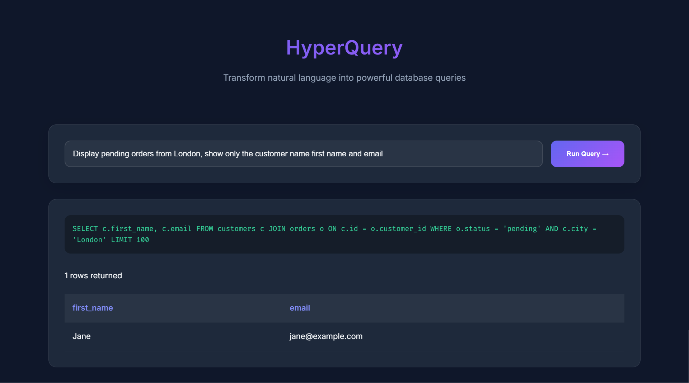
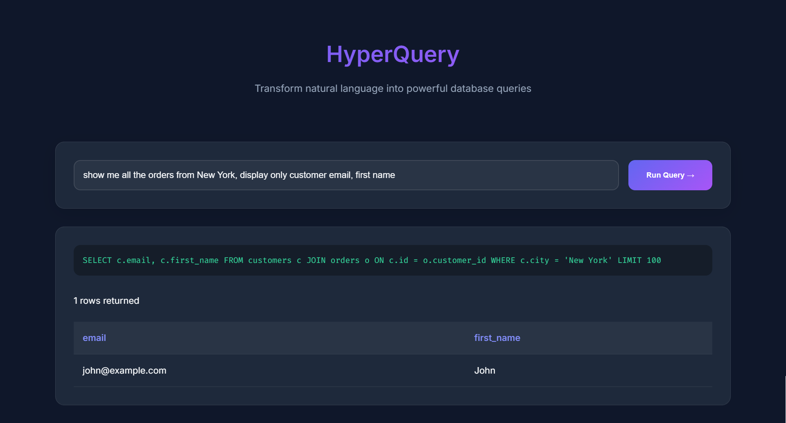

# HyperQuery 🔮⚡

**AI-Powered Natural Language to SQL Interface**

 
*screenshot of the front-end*

## Overview

HyperQuery transforms natural language questions into SQL queries using cutting-edge AI, executes them against your database, and presents results in beautiful HTML tables. Perfect for rapid data exploration without SQL expertise.

```bash
✨ "Show me customers from London with orders over $100 last month" → Executes SQL → Returns HTML Table
```

## How It Works

1. **Natural Language Processing**:  
   Utilizes Groq's Llama3-70B model to analyze input queries with database schema context
2. **SQL Generation**:  
   Produces type-safe SQL queries using Pydantic validation
3. **Query Execution**:  
   Safely executes read-only SELECT queries against SQLite
4. **Result Rendering**:  
   Converts database results to responsive HTML tables with client-side formatting

## Key Features

- 🧠 **AI-Powered Query Conversion** (Using Groq's Llama3-70B Model)
- 🛡️ **Safe SQL Execution** (Read-only SELECT queries)
- 🔄 **Dynamic Schema Awareness** (Auto-detects tables/columns)
- 📊 **Interactive Web Interface** (Vanilla JS + Modern CSS)
- 🚀 **Blazing Fast Backend** (FastAPI + SQLite)
- 🔍 **Query Transparency** (Shows generated SQL)

## Important Requirements

### Groq API Key
- **Mandatory**: Requires free API key from [Groq Cloud](https://console.groq.com/keys)
- **Rate Limits**: Subject to Groq's API quotas (currently 1000 requests/min for free tier)
- **Cost**: Free during beta, check [Groq Pricing](https://wow.groq.com/) for updates

### System Limitations
⚠️ **Important Notes**:
- Not production-ready - experimental prototype
- SQL generation accuracy varies (95-99% based on query complexity)
- Only supports SQLite databases (for now)
- No query history or persistence
- Results limited to 100 rows by default

## Tech Stack

**Backend**
- 🐍 Python 3.12
- ⚡ FastAPI (REST API)
- 🔐 Pydantic Settings (Configuration)
- 🤖 Groq API (AI Processing)
- 🗃️ SQLite (Database)
- 📦 Instructor (Structured Output)

**Frontend**
- 🌐 Vanilla JavaScript (ES6)
- 🎨 Modern CSS Grid/Flexbox
- 📄 Pure HTML (No frameworks)

## Getting Started

### Prerequisites
- Python 3.10+
- [Groq Developer Account](https://console.groq.com/signup)

### Installation

```bash
# Clone repo
git clone https://github.com/iamAliAsgharKhan/HyperQuery.git
cd HyperQuery

# Install dependencies
pip install -r requirements.txt

# Configure Groq API key
echo "GROQ_API_KEY=your_key_here" > .env

# Initialize sample database
python init_db.py

# Launch development server
uvicorn backend.main:app --reload
```

## Usage

1. Access web interface at `http://localhost:8000`
2. Try natural language queries:
   - "Show top 5 customers by total orders"
   - "Show total sales for each product"
   - "List customers who spent over $2000 in the last 3 months"
   - "Display products with average rating below 5 stars"

**Pro Tip**: Include table names and limited specific columns in your queries for better accuracy!



## Example Queries

```sql
❯ "Show monthly sales totals"
SELECT strftime('%Y-%m', order_date) AS month, 
       SUM(total_amount) AS total_sales
FROM orders
GROUP BY month
```

```sql
❯ "Find customers who bought laptops"
SELECT c.first_name, c.last_name, c.email
FROM customers c
JOIN orders o ON c.id = o.customer_id
JOIN products p ON o.product_id = p.id 
WHERE p.name LIKE '%Laptop%'
```

## Security Considerations

- All queries are executed as read-only SELECT
---

**Created with ❤️ by Ali Asghar**  

[](https://github.com/iamAliAsgharKhan/HyperQuery)
